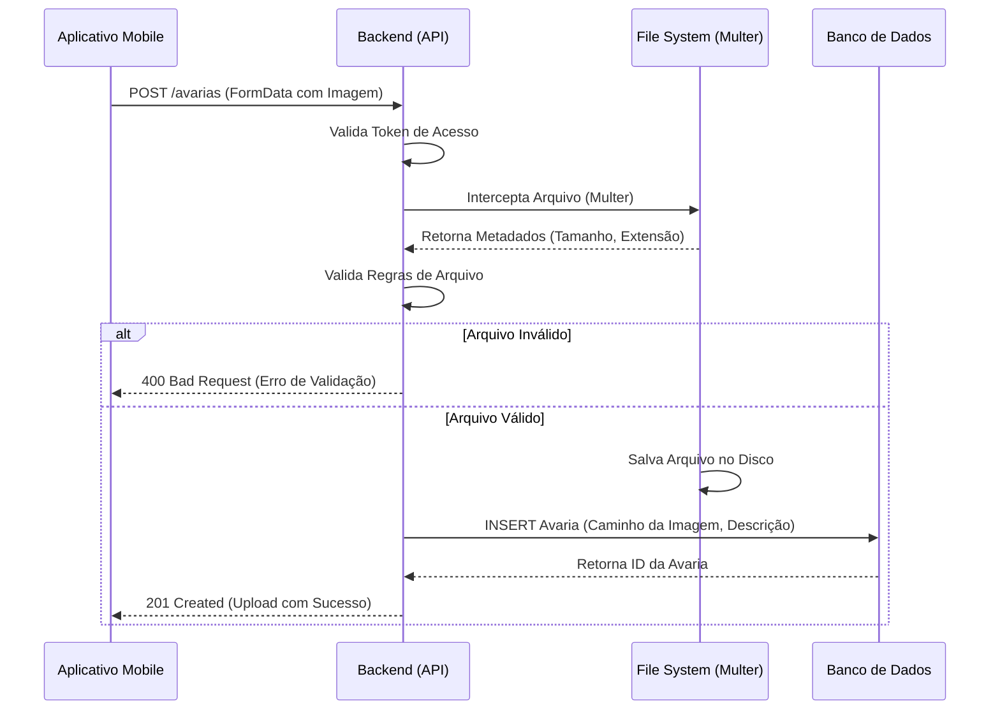
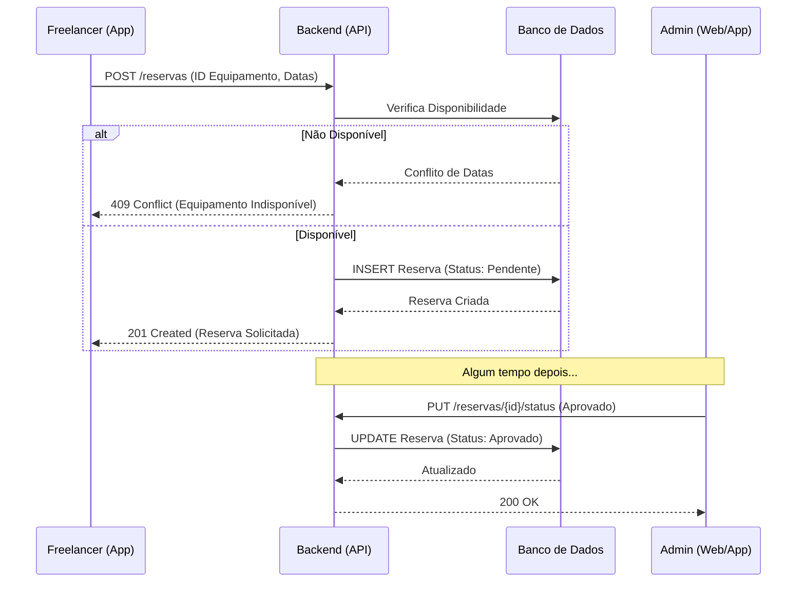
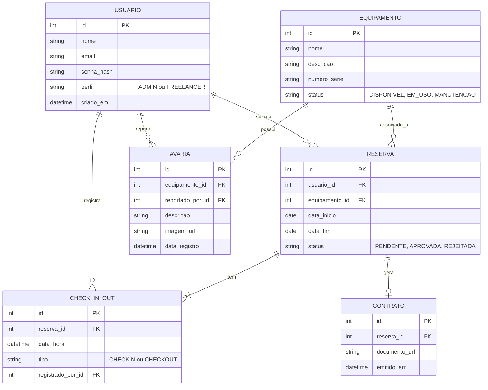

# Diagramas UML - Fase 1 (CaseTrack)

Abaixo estão os diagramas desenvolvidos para a Fase 1 do projeto, abrangendo Casos de Uso, Atividades, Sequência e o Modelo de Dados (DER).

## 1. Diagramas de Casos de Uso

### 1.1 Gestão de Equipamentos e Usuários (Foco Admin)
```mermaid
usecaseDiagram
    actor Admin as "Admin / Produtora"
    
    package "CaseTrack - Gestão Base" {
        usecase UC1 as "Gerenciar Usuários (CRUD)"
        usecase UC2 as "Gerenciar Equipamentos (CRUD)"
        usecase UC3 as "Visualizar Relatórios"
    }
    
    Admin --> UC1
    Admin --> UC2
    Admin --> UC3
```

### 1.2 Reserva, Check-in/out e Avarias (Foco Operacional)
```mermaid
usecaseDiagram
    actor Free as "Freelancer"
    actor Admin as "Admin / Produtora"
    
    package "CaseTrack - Operação" {
        usecase UC4 as "Solicitar Reserva"
        usecase UC5 as "Aprovar/Rejeitar Reserva"
        usecase UC6 as "Realizar Check-out"
        usecase UC7 as "Realizar Check-in"
        usecase UC8 as "Registrar Avaria (Upload)"
    }
    
    Free --> UC4
    Free --> UC6
    Free --> UC7
    Free --> UC8
    
    Admin --> UC5
    Admin --> UC6
    Admin --> UC7
```

---

## 2. Diagramas de Atividades

### 2.1 Fluxo de Check-out com Registro de Avaria
```mermaid
activityDiagram
    start
    :Usuário seleciona Equipamento;
    :Sistema exibe detalhes da Reserva;
    if (Equipamento possui avaria prévia?) then (Sim)
        :Usuário inspeciona avaria;
    else (Não)
    endif
    if (Nova avaria identificada?) then (Sim)
        :Usuário tira foto da avaria;
        :Upload da imagem (Multer);
        :Sistema valida (Tamanho, Extensão);
        if (Validação OK?) then (Sim)
            :Salva caminho da imagem BD;
        else (Não)
            :Exibe erro de Validação;
            stop
        endif
    else (Não)
    endif
    :Confirma Check-out;
    :Sistema atualiza Status do Equipamento para "Em Uso";
    stop
```

### 2.2 Fluxo de Autenticação e Controle de Acesso
```mermaid
activityDiagram
    start
    :Usuário insere Credenciais (Email/Senha);
    :Sistema valida credenciais;
    if (Credenciais Corretas?) then (Sim)
        :Sistema verifica Perfil (Role);
        if (Admin?) then (Sim)
            :Redireciona para Dashboard Produtora;
        else (Freelancer)
            :Redireciona para Home Freelancer;
        endif
    else (Não)
        :Exibe mensagem de "Acesso Negado";
    endif
    stop
```

---

## 3. Diagramas de Sequência

### 3.1 Fluxo de Upload de Imagem (Avaria)


### 3.2 Fluxo de Solicitação e Aprovação de Reserva


---

## 4. Diagrama Entidade-Relacionamento (DER)


